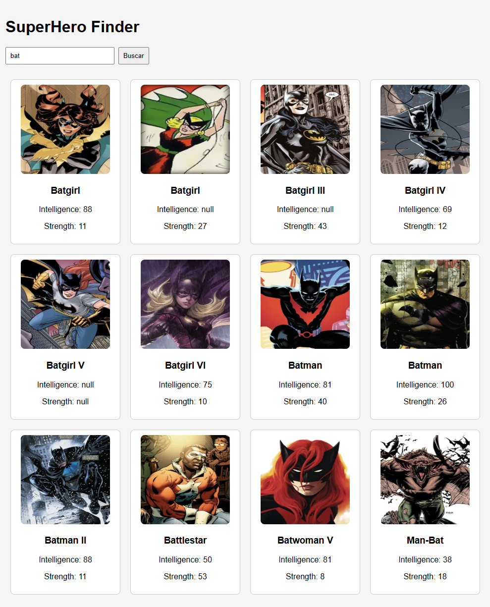

# SuperHero Finder

Projeto desenvolvido em React com Next.js para consumir a API de SuperHeróis.

---

## Funcionalidades

- Busca de super-heróis pelo nome.
- Exibição de imagem, inteligência e força de cada herói.
- Layout responsivo e organizado em cards.
- Uso de componente `SearchBar` para pesquisa e componente `HeroCard` para exibir informações do herói.

---

## Visualização



*A captura acima mostra a aplicação em funcionamento, exibindo os heróis em cards.*

---

## Como Rodar

1. Clone o repositório:

```bash
git clone https://github.com/seu-usuario/atv2-dw-react.git

2 . Entre na pasta do projeto
cd atv2-dw-react

3. Instale as dependências
npm install

4. Rode a aplicação
npm run start

5. Aba o navegador para visualização em
http://localhost:3000

Digigte um nome de super heroi e tecle em buscar


Estruturado projeto
atv2-dw-react/
├─ app/
│  ├─ api/search/route.ts      # Rota API para buscar heróis
│  ├─ layout.tsx               # Layout principal do projeto
│  └─ page.tsx                 # Página inicial com barra de busca e exibição de heróis
├─ components/
│  ├─ HeroCard.tsx             # Componente que exibe cada herói
│  └─ SearchBar.tsx            # Componente de input e botão de busca
├─ styles/
│  ├─ globals.css              # Estilos globais
│  └─ HeroCard.module.css      # Estilos específicos do HeroCard
├─ images/
│  └─ screenshot.png           # Captura de tela da aplicação
├─ package.json                # Dependências e scripts
├─ next.config.ts              # Configuração do Next.js
└─ README.md                   # Este arquivo

Tecnologias Utilizadas
    React 18
    Next.js 16 (Turbopack)
    TypeScript
    Axios
    CSS Modules

Autor
    Rogerio Pupo Toledo
    Desenvolvido como atividade prática da disciplina de Desenvolvimento Web (DW3).